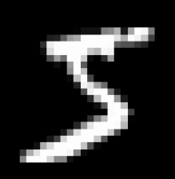
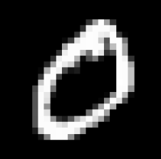
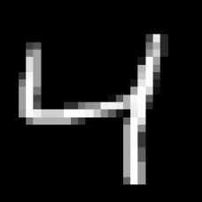

# Handwritten Digit Recognition Neural Network from Scratch ✏️🧠

This project implements a **fully connected neural network built entirely from scratch in Python** using only **NumPy and Pandas** — no TensorFlow or PyTorch here! It’s trained to recognize handwritten digits (0–9) from the [MNIST dataset](https://www.kaggle.com/datasets/oddrationale/mnist-in-csv) 🖼️.

The network takes **28×28 grayscale images** as input, flattens them into a 784-length vector, and predicts which digit the image represents.

---

## How It Works 🧩

1. **Input Layer**:  
   Each image is 28×28 pixels → flattened to a vector of 784 features. 🖼️  

2. **Hidden Layers**:  
   - Hidden Layer 1: 128 units, Sigmoid activation ⚡  
   - Hidden Layer 2: 64 units, Sigmoid activation ⚡  

3. **Output Layer**:  
   - 10 units (0–9), Softmax activation 🎯  
   - The network outputs probabilities for each digit and selects the one with the highest probability.  

4. **Training**:  
   - Forward propagation and backpropagation implemented manually ✍️  
   - Cross-entropy loss for multi-class classification 📉  
   - Batch training with adjustable batch size and learning rate ⚙️  

5. **Prediction**:  
   - The network can predict the digit for single images and display the true vs predicted label 🔍  

---

## Example MNIST Input Images 🖼️

Below are some sample images from the MNIST dataset that the network uses as input:

  
*Example: digit 5*

  
*Example: digit 0*

  
*Example: digit 4*

> The network will flatten these 28×28 images into a 784-length vector before processing.

---

## Features 🚀

- Fully connected neural network built from scratch
- Manual implementation of forward & backward propagation
- One-hot encoding for labels 🎨
- Achieves around **92% accuracy** on MNIST test data ✅

---

## 🌃 End of the Line, Choomba  
Thanks for checking out this little project.  
BYE! BYE!

