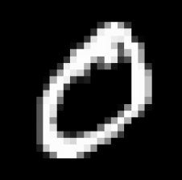
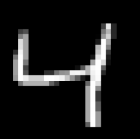

# Neural Network from Scratch for MNIST Classification

A fully connected neural network implemented from scratch using only **NumPy** and **Pandas**, without relying on deep learning frameworks such as TensorFlow or PyTorch. The project implements every stage of the learning pipeline—from parameter initialization and forward propagation to backpropagation and gradient-based optimization—to classify handwritten digits from the MNIST dataset.

---

## Results

- **~92% classification accuracy** on the MNIST test set
- Manual implementation of the complete training pipeline
- No automatic differentiation or deep learning libraries

---

## Architecture

| Component | Implementation |
|----------|----------------|
| Input | 784-dimensional flattened image |
| Hidden Layer 1 | 128 neurons (Sigmoid) |
| Hidden Layer 2 | 64 neurons (Sigmoid) |
| Output | 10 neurons (Softmax) |
| Loss | Cross-Entropy |
| Optimization | Mini-batch Gradient Descent |

---

## Features

- Built the neural network entirely from first principles
- Implemented forward propagation and backpropagation manually
- Derived and coded gradient calculations without automatic differentiation
- Implemented mini-batch training and parameter updates using NumPy
- Used one-hot encoding and softmax classification for multi-class prediction
- Evaluated model performance on the MNIST dataset

---

## Sample Inputs

  
  
  

---

## Why This Project?

Modern machine learning frameworks abstract away much of the optimization process. This project was built to better understand the mathematical and computational foundations of neural networks by implementing each component from scratch using only numerical computing libraries.

---

